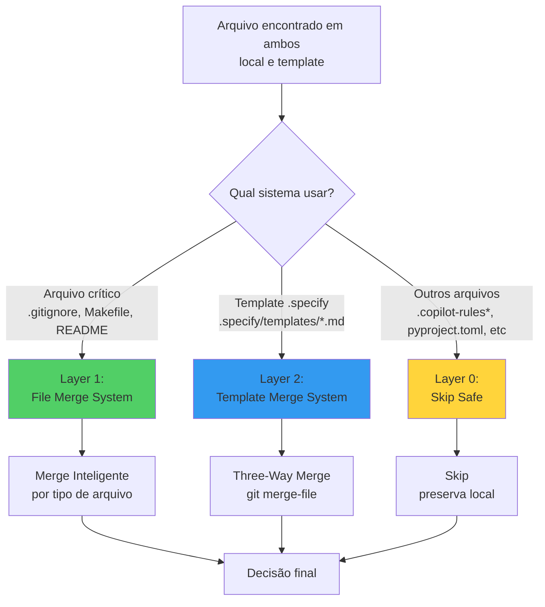
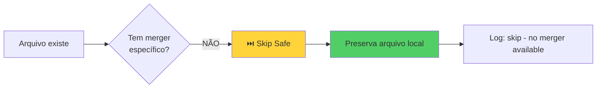
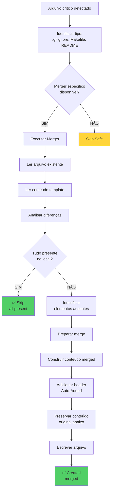
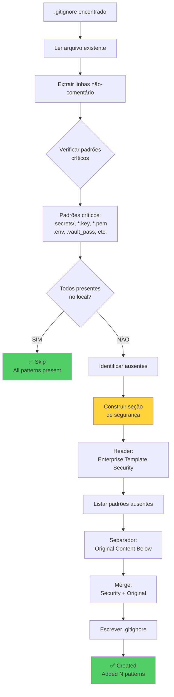
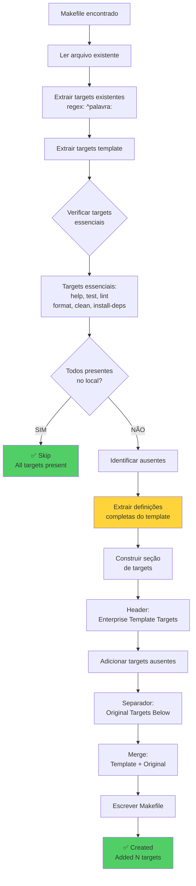
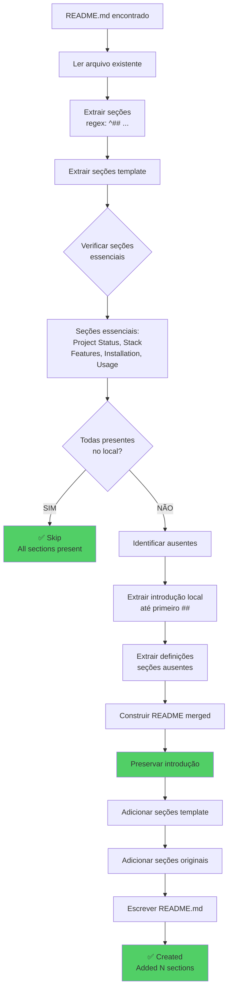
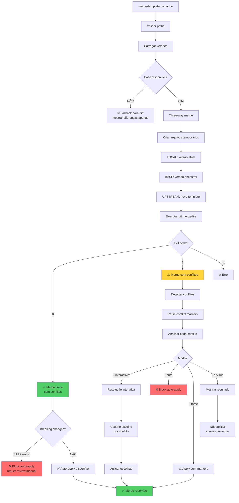

# 🔄 Project Update Decision Workflow

**Data**: 2026-05-11
**Componente**: Scaffold Template Merge System
**Objetivo**: Documentar lógica de decisão para atualização de arquivos quando há conflito de nomes

---

## 📋 Visão Geral

O sistema de **atualização de projetos** implementa uma arquitetura em **três camadas** para decidir se sobrescreve ou não arquivos existentes durante merge/atualização de templates:

### Camada 0: Skip Safe (Fallback)
Comportamento padrão seguro para arquivos sem merger específico

### Camada 1: File Merge System
Sistema de merge inteligente para **arquivos críticos específicos** (.gitignore, Makefile, README.md)

### Camada 2: Template Merge System
Sistema de **three-way merge** para templates em `.specify/templates/*.md` usando git merge-file

---

## ⚠️ Escopo Atual e Limitações

### **📊 Visão Geral da Cobertura**

O `scaffold-project` gera **~100 arquivos** distribuídos em 7 categorias. Cobertura atual de merge:

| Categoria | Total Arquivos | Com Merge | Cobertura | Status |
|-----------|----------------|-----------|-----------|--------|
| **Agentes Copilot** | 32+ | 0 | 0% | 🔴 **Gap Crítico** |
| **Prompts Copilot** | 26+ | 0 | 0% | 🔴 **Gap Crítico** |
| **Workflows GitHub** | 3+ | 0 | 0% | 🔴 **Gap Importante** |
| **Arquivos Raiz** | 15+ | 3 | 20% | 🟡 Parcial |
| **SpecKit Templates** | 10+ | 10+ | 100% | ✅ Layer 2 |
| **VS Code Configs** | 3 | 0 | 0% | 🟡 Gap Médio |
| **Issue Templates** | 5+ | 0 | 0% | 🟡 Gap Médio |
| **Documentação** | 10+ | 0 | 0% | ⚪ Baixa prioridade |
| **TOTAL** | **~100** | **~13** | **~13%** | 🔴 **Cobertura Baixa** |

---

### **Arquivos COM merge inteligente** (Layer 1 - 3 mergers):
- ✅ `.gitignore` → GitignoreMerger (P0 CRITICAL - segurança)
- ✅ `Makefile` → MakefileMerger (P1 HIGH - workflow)
- ✅ `README.md` → ReadmeMerger (P1 HIGH - documentação)

### **Templates Markdown COM merge** (Layer 2):
- ✅ `.specify/templates/*.md` → Three-way merge via git merge-file (comando `scaffold.py merge-template`)

---

### **Arquivos SEM merge inteligente** (Layer 0 - Skip Safe):

#### **🔴 Gap Crítico (P0)** - Boas Práticas e Automação
- ⚠️ **`.github/agents/*.agent.md` (32+ arquivos)** - Agentes Copilot incluindo:
  - `session-manager.agent.md` ⭐ **CRITICAL** - Workflows não atualizados
  - Família SpecKit (9 agentes)
  - Família Git (5 agentes)
  - DevOps, SE, Domain Experts (15+ agentes)
- ⚠️ **`.github/prompts/*.prompt.md` (26+ arquivos)** - Prompts Copilot
- ⚠️ `.copilot-rules.md` / `.copilot-rules-[projeto].md` (gerados mas não mesclados)

#### **🔴 Gap Importante (P1)** - Dependências e Segurança
- ⚠️ **`.github/workflows/*.yml` (3+ arquivos)** - Workflows de CI/CD e segurança
- ⚠️ `pyproject.toml` (configuração Python)
- ⚠️ `.pre-commit-config.yaml` (hooks de segurança)

#### **🟡 Gap Médio (P2)** - Configuração e Templates
- ⚠️ **`.vscode/*.json` (3 arquivos)** - Configs VS Code (mcp.json, settings.json, extensions.json)
- ⚠️ **`.github/ISSUE_TEMPLATE/*.md` (5+ arquivos)** - Templates de issues
- ⚠️ `.gitleaks.toml` (detector de secrets)
- ⚠️ `.gitguardian.yaml` (scanner de credenciais)
- ⚠️ `objetivo.yaml`, `mcp-questions.yaml` (manifests)

#### **⚪ Gap Baixo (P3)** - Documentação
- ⚠️ **`docs/*.md` (10+ arquivos)** - Documentação estrutural
- ⚠️ Outros arquivos do template base

**Implicação**: Arquivos listados acima são **preservados intactos** se já existem no projeto (não recebem atualizações do template)

**Expansão Futura**: Sistema permite registrar novos mergers via `register_merger()`

---

### **📈 Impacto dos Gaps**

| Gap | Arquivos | Impacto | Consequência |
|-----|----------|---------|--------------|
| Agentes não atualizados | 32+ | 🔴 **CRÍTICO** | Session-manager sem time tracking, SpecKit agents sem melhorias |
| Prompts não atualizados | 26+ | 🔴 **CRÍTICO** | Prompt engineering improvements não propagados |
| Workflows não atualizados | 3+ | 🔴 **ALTO** | Security workflows desatualizados, novos workflows não adicionados |
| Copilot rules não mescladas | 2+ | 🔴 **ALTO** | Melhores práticas não disseminadas |
| pyproject.toml não atualizado | 1 | 🔴 **ALTO** | Dependências e ferramentas desatualizadas |
| Pre-commit hooks não atualizados | 1 | 🟡 **MÉDIO** | Hooks de segurança obsoletos |
| VS Code configs não atualizados | 3 | 🟡 **MÉDIO** | MCP servers, settings e extensões não propagados |

**Conclusão**: Sistema atual cobre apenas **~13% dos arquivos gerados**, com **gaps críticos em 60+ arquivos** de automação e boas práticas.

---

## 🎯 Cenário do Problema

```
Situação: Atualizar projeto existente com novo template

Projeto Local:                Template Upstream:
├── .gitignore (v1.0)        ├── .gitignore (v2.0)
├── Makefile (custom)        ├── Makefile (novos targets)
├── README.md (intro)        ├── README.md (novas seções)
└── src/                     └── src/

❓ QUESTÃO: O que fazer quando encontra .gitignore no projeto E no template?
```

---

## 🔀 Arquitetura de Decisão



---

## 🔍 Layer 0: Skip Safe (Fallback)

**Quando**: Arquivo genérico sem merger específico
**Decisão**: ❌ **NÃO sobrescrever** (preserva local)



**Código**:
```python
def merge_or_skip(file_path: Path, template_content: str):
    # Tentar encontrar merger apropriado
    for merger in _MERGERS:
        if merger.can_merge(file_path):
            return merger.merge(file_path, template_content)

    # Sem merger → skip (comportamento seguro)
    return CreatedItem(
        path=file_path,
        status="skipped",
        message="File exists, no merger available"
    )
```

**Exemplos**:
- `config.json` → ⏭️ Skip (preserva config do usuário)
- `custom.py` → ⏭️ Skip (preserva código custom)
- `notes.txt` → ⏭️ Skip (preserva documentação local)
- `.copilot-rules.md` → ⏭️ Skip (sem merger específico - **GAP**)
- `pyproject.toml` → ⏭️ Skip (sem merger específico - **GAP**)
- `.pre-commit-config.yaml` → ⏭️ Skip (sem merger específico - **GAP**)

---

## 🔍 Layer 1: File Merge System

**Quando**: Arquivos críticos específicos (.gitignore, Makefile, README)
**Decisão**: ✅ **Merge inteligente** com preservação de customizações

### 📊 Fluxo de Decisão Geral



---

### 1️⃣ GitignoreMerger — Segurança (P0 CRITICAL)

**Estratégia**: Adicionar padrões de segurança ausentes sem duplicar



**Algoritmo**:
```python
def merge_gitignore(existing_path, template_content):
    # 1. Ler existente
    existing_lines = set(line for line in existing.splitlines()
                        if line and not line.startswith("#"))

    # 2. Detectar ausentes
    missing = [p for p in CRITICAL_PATTERNS if p not in existing_lines]

    # 3. Decisão
    if not missing:
        return skip("All patterns present")

    # 4. Merge
    security_section = f"""
# === Enterprise Template Security (Auto-Added) ===
# CRITICAL: Never commit credentials
{"\n".join(missing)}

# === Original Content Below ===
"""

    merged = security_section + existing_content

    # 5. Sobrescrever com merge
    existing_path.write_text(merged)

    return created(f"Added {len(missing)} patterns")
```

**Exemplo Real**:
```diff
Antes (.gitignore local):
  node_modules/
  dist/
  .env

Depois (merged):
+ # === Enterprise Template Security (Auto-Added) ===
+ # CRITICAL: Never commit credentials
+ # Added: 2026-05-11 14:30:00
+ .secrets/
+ *.key
+ *.pem
+ .vault_pass
+ *secret*
+ *password*
+ *token*
+
+ # === Original Content Below ===
  node_modules/
  dist/
  .env
```

**Decisão**: ✅ **Sobrescrever** com conteúdo merged (segurança adicionada + original preservado)

---

### 2️⃣ MakefileMerger — Workflow (P1 IMPORTANT)

**Estratégia**: Adicionar targets ausentes preservando customizações



**Algoritmo**:
```python
def merge_makefile(existing_path, template_content):
    # 1. Extrair targets
    target_pattern = re.compile(r'^([a-zA-Z0-9_-]+):', re.MULTILINE)
    existing_targets = set(target_pattern.findall(existing_content))

    # 2. Detectar ausentes
    missing = [t for t in ESSENTIAL_TARGETS if t not in existing_targets]

    # 3. Decisão
    if not missing:
        return skip("All targets present")

    # 4. Extrair definições completas
    missing_definitions = []
    for target in missing:
        pattern = re.compile(rf'^({target}:.*?)(?=^\S|\Z)', re.MULTILINE | re.DOTALL)
        match = pattern.search(template_content)
        if match:
            missing_definitions.append(match.group(1))

    # 5. Merge
    template_section = f"""
# === Enterprise Template Targets (Auto-Added) ===
{"\n\n".join(missing_definitions)}

# === Original Targets Below ===
"""

    merged = template_section + existing_content
    existing_path.write_text(merged)

    return created(f"Added {len(missing)} targets")
```

**Exemplo Real**:
```diff
Antes (Makefile local):
  build:
  	npm run build

  deploy:
  	./deploy.sh

Depois (merged):
+ # === Enterprise Template Targets (Auto-Added) ===
+ help:  ## Show available commands
+ 	@grep -E '^[a-zA-Z_-]+:.*?## .*$$' $(MAKEFILE_LIST)
+
+ test:  ## Run tests
+ 	npm test
+
+ lint:  ## Run linter
+ 	npm run lint
+
+ # === Original Targets Below ===
  build:
  	npm run build

  deploy:
  	./deploy.sh
```

**Decisão**: ✅ **Sobrescrever** com merge (targets template + targets custom preservados)

---

### 3️⃣ ReadmeMerger — Documentação (P1 IMPORTANT)

**Estratégia**: Adicionar seções ausentes preservando introdução do usuário



**Algoritmo**:
```python
def merge_readme(existing_path, template_content):
    # 1. Extrair seções
    section_pattern = re.compile(r'^## (.+?)$', re.MULTILINE)
    existing_sections = set(section_pattern.findall(existing_content))

    # 2. Detectar ausentes
    missing = [s for s in ESSENTIAL_SECTIONS if s not in existing_sections]

    # 3. Decisão
    if not missing:
        return skip("All sections present")

    # 4. Extrair introdução preservada
    intro_match = re.match(r'^(.*?)(?=^##|\Z)', existing_content, re.DOTALL)
    intro = intro_match.group(1).rstrip() if intro_match else ""

    # 5. Extrair definições de seções ausentes
    missing_definitions = []
    for section in missing:
        pattern = re.compile(rf'^(## {re.escape(section)}.*?)(?=^##|\Z)',
                            re.MULTILINE | re.DOTALL)
        match = pattern.search(template_content)
        if match:
            missing_definitions.append(match.group(1))

    # 6. Merge
    merged = intro + "\n\n---\n\n"
    merged += "<!-- Enterprise Template Sections (Auto-Added) -->\n\n"
    merged += "\n\n".join(missing_definitions)
    merged += "\n\n---\n\n<!-- Original Sections Below -->\n\n"

    # Adicionar seções originais
    original_sections = re.search(r'^##.*', existing_content, re.MULTILINE | re.DOTALL)
    if original_sections:
        merged += original_sections.group(0)

    existing_path.write_text(merged)

    return created(f"Added {len(missing)} sections")
```

**Exemplo Real**:
```diff
Antes (README.md local):
  # My Awesome Project

  This is my cool project that does X, Y, Z.

  ## Custom Section
  My custom notes here.

Depois (merged):
  # My Awesome Project

  This is my cool project that does X, Y, Z.

  ---

+ <!-- Enterprise Template Sections (Auto-Added) -->
+
+ ## Project Status
+
+ Current version: 1.0.0
+ Status: Active Development
+
+ ## Stack
+
+ - Node.js 18+
+ - TypeScript 5.0
+
+ ## Features
+
+ - Feature A
+ - Feature B
+
+ ## Installation
+
+ ```bash
+ npm install
+ ```
+
+ ## Usage
+
+ ```bash
+ npm start
+ ```

  ---

  <!-- Original Sections Below -->

  ## Custom Section
  My custom notes here.
```

**Decisão**: ✅ **Sobrescrever** com merge (intro preservada + seções template + seções custom)

---

## 🔍 Layer 2: Template Merge System

**Quando**: Templates markdown em `.specify/templates/*.md` (comando `scaffold.py merge-template`)
**Decisão**: ✅ **Three-way merge** usando git merge-file
**Nota**: Outros templates do projeto (`.copilot-rules*`, `pyproject.toml`, etc.) NÃO usam este sistema

### 📊 Fluxo Three-Way Merge



---

### Algoritmo Three-Way Merge

```python
def merge_templates(local_path, upstream_path, base_content):
    """
    Perform three-way merge using git merge-file.

    Processo:
    1. Criar 3 arquivos temporários: LOCAL, BASE, UPSTREAM
    2. Executar: git merge-file -p --diff3 LOCAL BASE UPSTREAM
    3. Analisar exit code:
       - 0: merge limpo (sem conflitos)
       - 1: merge com conflitos
       - >1: erro fatal
    4. Decisão baseada em conflitos e flags
    """

    # 1. Criar arquivos temporários
    with tempfile.NamedTemporaryFile() as local_tmp, \
         tempfile.NamedTemporaryFile() as base_tmp, \
         tempfile.NamedTemporaryFile() as upstream_tmp:

        local_tmp.write(local_path.read_bytes())
        base_tmp.write(base_content.encode())
        upstream_tmp.write(upstream_path.read_bytes())

        # 2. Executar git merge-file
        result = subprocess.run([
            "git", "merge-file",
            "-p",              # Output to stdout
            "--diff3",         # Show base in conflicts
            "-L", "LOCAL",
            "-L", "BASE",
            "-L", "UPSTREAM",
            local_tmp.name,
            base_tmp.name,
            upstream_tmp.name
        ], capture_output=True)

        merged_content = result.stdout.decode()
        has_conflicts = result.returncode == 1

        # 3. Analisar resultado
        if result.returncode > 1:
            return MergeResult(
                success=False,
                error_message="git merge-file failed"
            )

        # 4. Detectar e classificar conflitos
        conflicts = detect_conflicts(merged_content) if has_conflicts else []

        return MergeResult(
            success=True,
            merged_content=merged_content,
            has_conflicts=has_conflicts,
            conflicts=conflicts
        )
```

---

### Detecção e Classificação de Conflitos

```mermaid
flowchart TD
    A[Merged content com markers] --> B[Parse conflict markers]
    B --> C[Encontrar blocos:<br/><<<<<<< LOCAL<br/>...<br/>|||||||  BASE<br/>...<br/>=======<br/>...<br/>>>>>>>> UPSTREAM]

    C --> D{Analisar conteúdo<br/>de cada seção}

    D --> E{BASE vazio?}
    E -->|SIM| F{LOCAL vazio?}
    E -->|NÃO| G{LOCAL e UPSTREAM<br/>ambos modificados?}

    F -->|SIM + UPSTREAM tem| H[upstream_added<br/>novo conteúdo upstream]
    F -->|NÃO + UPSTREAM vazio| I[local_added<br/>customização local]
    F -->|NÃO + UPSTREAM tem| J[both_added<br/>ambos adicionaram]

    G -->|SIM| K[both_modified<br/>conflito real]
    G -->|NÃO + LOCAL vazio| L[upstream_added]
    G -->|NÃO + UPSTREAM vazio| M[local_added]

    H --> N[Gerar sugestão]
    I --> N
    J --> N
    K --> N
    L --> N
    M --> N

    N --> O[Conflict com metadata]

    style H fill:#339af0
    style I fill:#51cf66
    style J fill:#ffd43b
    style K fill:#ff6b6b
```

**Código de Classificação**:
```python
def classify_conflict(local_content, base_content, upstream_content):
    """
    Classifica tipo de conflito para sugestão inteligente.
    """
    if not base_content:
        # Não havia conteúdo no base
        if not local_content:
            return "upstream_added"  # Só upstream adicionou
        elif not upstream_content:
            return "local_added"     # Só local adicionou
        else:
            return "both_added"      # Ambos adicionaram (raro)

    elif not local_content:
        return "upstream_added"      # Local deletou, upstream modificou

    elif not upstream_content:
        return "local_added"         # Local modificou, upstream deletou

    else:
        return "both_modified"       # Conflito real - ambos modificaram
```

---

### Sugestões de Resolução por Tipo

| Tipo de Conflito | Sugestão | Ação Recomendada |
|------------------|----------|------------------|
| **both_modified** | Ambos modificaram | 🔍 Review manual cuidadoso |
| **local_added** | Customização local | ✅ **Keep local** (preservar) |
| **upstream_added** | Nova feature upstream | ✅ **Accept upstream** (aplicar) |
| **both_added** | Ambos adicionaram | ⚠️ Review para mesclar ambos |

```python
def suggest_resolution(conflict_type):
    """
    Gera sugestão de resolução baseada no tipo de conflito.
    """
    suggestions = {
        "both_modified": (
            "Both local and upstream modified this section.\n"
            "Review carefully and choose the best combination."
        ),
        "local_added": (
            "Local customization not present in upstream.\n"
            "Recommendation: Keep local content (your customization)."
        ),
        "upstream_added": (
            "New content from upstream not in local.\n"
            "Recommendation: Accept upstream content (new feature)."
        ),
        "both_added": (
            "Both added content in same location.\n"
            "Review to determine if both should be kept."
        ),
    }
    return suggestions.get(conflict_type, "Unknown conflict type")
```

---

## 📊 Matriz Completa de Decisão

### Layer 0: Skip Safe

| Arquivo | Tem Merger? | Decisão | Resultado | Observação |
|---------|-------------|---------|-----------|------------|
| config.json | ❌ Não | ⏭️ Skip | Preserva local | ✅ Comportamento correto |
| custom.py | ❌ Não | ⏭️ Skip | Preserva local | ✅ Comportamento correto |
| notes.txt | ❌ Não | ⏭️ Skip | Preserva local | ✅ Comportamento correto |
| .copilot-rules.md | ❌ Não | ⏭️ Skip | Preserva local | ⚠️ **GAP** - deveria ter merger |
| pyproject.toml | ❌ Não | ⏭️ Skip | Preserva local | ⚠️ **GAP** - deveria ter merger |
| .pre-commit-config.yaml | ❌ Não | ⏭️ Skip | Preserva local | ⚠️ **GAP** - deveria ter merger |

### Layer 1: File Merge System

| Arquivo | Merger | Elementos Ausentes? | Decisão | Resultado |
|---------|--------|---------------------|---------|-----------|
| .gitignore | GitignoreMerger | ❌ Não | ⏭️ Skip | Todos padrões presentes |
| .gitignore | GitignoreMerger | ✅ 3 patterns | ✅ Merge | Adiciona 3 + preserva original |
| Makefile | MakefileMerger | ❌ Não | ⏭️ Skip | Todos targets presentes |
| Makefile | MakefileMerger | ✅ 2 targets | ✅ Merge | Adiciona 2 + preserva custom |
| README.md | ReadmeMerger | ❌ Não | ⏭️ Skip | Todas seções presentes |
| README.md | ReadmeMerger | ✅ 4 seções | ✅ Merge | Adiciona 4 + preserva intro/custom |

---

### Layer 2: Template Merge System

| Situação | Base? | Conflitos? | Flags | Decisão | Resultado |
|----------|-------|------------|-------|---------|-----------|
| Merge limpo | ✅ | ❌ Não | --auto | ✅ Apply | Sobrescreve com merge |
| Merge limpo | ✅ | ❌ Não | *default* | ✅ Apply | Sobrescreve com merge |
| Merge limpo + Breaking | ✅ | ❌ Não | --auto | ❌ Block | Requer review manual |
| Merge limpo + Breaking | ✅ | ❌ Não | --force | ✅ Apply | Sobrescreve com merge |
| Com conflitos | ✅ | ✅ Sim | --auto | ❌ Block | Não aplica |
| Com conflitos | ✅ | ✅ Sim | --interactive | 🔧 Interactive | Usuário resolve |
| Com conflitos | ✅ | ✅ Sim | --force | ⚠️ Apply | Aplica com markers |
| Com conflitos | ✅ | ✅ Sim | --dry-run | 📄 Show | Não aplica |
| Sem base | ❌ | N/A | *any* | 📊 Diff | Mostra diff apenas |

---

## 🎯 Exemplos Práticos Completos

### Exemplo 1: .gitignore com Padrões Ausentes

**Contexto**:
```bash
# Comando
scaffold.py new backend-api --profile python-fastapi

# Situação
.gitignore já existe no projeto
```

**Análise**:
```python
# 1. Layer 0: Tem merger específico?
→ SIM: GitignoreMerger pode processar .gitignore

# 2. Layer 1: GitignoreMerger executa
existing_lines = {
    "node_modules/",
    "dist/",
    ".env"
}

CRITICAL_PATTERNS = [
    ".secrets/", "*.key", "*.pem",
    ".vault_pass", "*secret*", etc.
]

missing_patterns = [
    ".secrets/", "*.key", "*.pem",
    ".vault_pass", "*secret*", ...
]  # 5 padrões ausentes

# 3. Decisão: missing_patterns não vazio
→ Merge necessário
```

**Ação**:
```python
# Construir merge
security_section = """
# === Enterprise Template Security (Auto-Added) ===
# CRITICAL: Never commit credentials
# Added: 2026-05-11 14:30:00
.secrets/
*.key
*.pem
.vault_pass
*secret*

# === Original Content Below ===
"""

merged = security_section + existing_content

# Sobrescrever arquivo
existing_path.write_text(merged)
```

**Resultado**: ✅ **Sobrescreve** com conteúdo merged (segurança + original)

---

### Exemplo 2: Template Markdown com Conflitos

**Contexto**:
```bash
# Comando
scaffold.py merge-template spec-template.md --interactive

# Versões
Local:    v1.0.0
Upstream: v2.0.0
Base:     v1.0.0
```

**Análise**:
```python
# 1. Layer 2: Template Merge System
→ Template completo (.md)
→ Base disponível (v1.0.0)

# 2. Three-way merge
LOCAL:    "## Title\nMy custom intro\n## Section A"
BASE:     "## Title\nDefault intro\n## Section A"
UPSTREAM: "## Title\nImproved intro\n## Section A\n## Section B"

# 3. git merge-file resultado
EXIT CODE: 1 (conflitos)

MERGED:
## Title
<<<<<<< LOCAL
My custom intro
||||||| BASE
Default intro
=======
Improved intro
>>>>>>> UPSTREAM
## Section A
## Section B

# 4. Detectar conflitos
conflicts = [
    ConflictRegion(
        start_line=1,
        end_line=7,
        local_content="My custom intro",
        upstream_content="Improved intro",
        region_type="both_modified"  # Ambos modificaram
    )
]
```

**Decisão Interativa**:
```
🔍 Conflict 1/1 (both_modified)

Lines 1-7:

LOCAL (your version):
  My custom intro

UPSTREAM (new version):
  Improved intro

Suggestion: Both local and upstream modified this section.
Review carefully and choose the best combination.

Choose:
[1] Keep local (your version)
[2] Accept upstream (new version)
[3] Edit manually
[4] Keep both

User selects: [3] Edit manually

User edits:
  My custom intro with improved style

Resolution applied.
```

**Resultado**: ✅ **Sobrescreve** com resolução do usuário

---

### Exemplo 3: Arquivo Sem Merger (Skip Safe)

**Contexto**:
```bash
# Comando
scaffold.py new backend-api --profile python-fastapi

# Situação
config/database.json já existe no projeto
```

**Análise**:
```python
# 1. Layer 0: Tem merger específico?
file_path = Path("config/database.json")

for merger in _MERGERS:  # [GitignoreMerger, MakefileMerger, ReadmeMerger]
    if merger.can_merge(file_path):
        ...

→ NÃO: Nenhum merger pode processar .json

# 2. Decisão: Skip Safe (fallback)
→ Preservar arquivo local (comportamento seguro)
```

**Ação**:
```python
return CreatedItem(
    path=file_path,
    kind="file",
    status="skipped",
    message="File exists, no merger available"
)
```

**Resultado**: ⏭️ **Skip** - arquivo local preservado intacto

---

## 🧪 Validação com Testes

### Testes File Merge System

| Teste | Cenário | Resultado Esperado | Status |
|-------|---------|-------------------|--------|
| test_gitignore_all_present | Todos padrões presentes | Skip | ✅ |
| test_gitignore_missing_patterns | 3 padrões ausentes | Merge com 3 adições | ✅ |
| test_makefile_all_targets | Todos targets presentes | Skip | ✅ |
| test_makefile_missing_targets | 2 targets ausentes | Merge com 2 adições | ✅ |
| test_readme_all_sections | Todas seções presentes | Skip | ✅ |
| test_readme_missing_sections | 4 seções ausentes | Merge com 4 adições | ✅ |
| test_generic_file_no_merger | Arquivo .json sem merger | Skip safe | ✅ |

### Testes Template Merge System

| Teste | Cenário | Resultado Esperado | Status |
|-------|---------|-------------------|--------|
| test_merge_clean_no_conflicts | Merge limpo | Apply automático | ✅ |
| test_merge_with_conflicts | Com conflitos | Detectar e classificar | ✅ |
| test_merge_breaking_auto_blocked | Breaking + --auto | Block auto-apply | ✅ |
| test_merge_interactive_resolution | --interactive | Resolve conflitos | ✅ |
| test_merge_no_base_fallback | Sem base | Fallback para diff | ✅ |

---

## 🎓 Princípios de Design

### 1. Segurança em Primeiro Lugar
- **Skip Safe**: Quando em dúvida, preserva local
- **Merge Aditivo**: Nunca remove conteúdo do usuário
- **Backup Automático**: Templates críticos têm backup antes de merge

### 2. Preservação de Customizações
- **Merge Inteligente**: Adiciona ausentes, preserva existentes
- **Three-Way Merge**: Usa base para detectar o que mudou onde
- **Conflict Detection**: Identifica conflitos reais vs. adições paralelas

### 3. Transparência
- **Headers Explícitos**: Seções auto-adicionadas são marcadas
- **Logging Detalhado**: Todas decisões são registradas
- **Dry-Run**: Visualizar resultado antes de aplicar

### 4. Controle do Usuário
- **Interactive Mode**: Usuário resolve conflitos manualmente
- **Force Flag**: Aplicar mesmo com conflitos (expert mode)
- **Auto Flag**: Aplicar apenas se limpo (CI/CD mode)

### 5. Extensibilidade
- **Registry Pattern**: Sistema permite registrar novos mergers via `register_merger()`
- **Protocol Interface**: Qualquer classe que implemente `FileMerger` pode ser adicionada
- **Prioridade**: Mergers mais específicos devem ser registrados primeiro

---

## 📝 Comandos e Flags

### File Merge (Automático)
```bash
# Merge automático durante scaffold
scaffold.py new backend-api --profile python-fastapi

# Mergers aplicados automaticamente:
# - .gitignore → GitignoreMerger
# - Makefile → MakefileMerger
# - README.md → ReadmeMerger
# - Outros → Skip safe
```

### Template Merge (Explícito)
```bash
# Merge limpo: aplica automaticamente
scaffold.py merge-template spec-template.md

# Com conflitos: resolução interativa
scaffold.py merge-template spec-template.md --interactive

# Auto-apply apenas se limpo
scaffold.py merge-template spec-template.md --auto

# Forçar aplicação mesmo com conflitos
scaffold.py merge-template spec-template.md --force

# Dry-run: apenas visualizar
scaffold.py merge-template spec-template.md --dry-run
```

---

## � Gaps e Oportunidades de Expansão

### ⚠️ **Arquivos Críticos Sem Merge Inteligente**

O sistema atual tem **gaps importantes** em arquivos que deveriam ter merge mas usam fallback "Skip Safe":

#### 1. `.copilot-rules.md` / `.copilot-rules-[projeto].md`
**Problema**:
- São **gerados** pelo scaffold (`scripts/lib/templates.py`)
- Mas **não têm merge** quando já existem no projeto
- Novas regras do scaffold-project não são propagadas

**Impacto**:
- Projetos não recebem novas regras de Copilot do template upstream
- Melhores práticas não são disseminadas automaticamente

**Solução Proposta**:
```python
class CopilotRulesMerger:
    """Merge inteligente de .copilot-rules*.md"""

    def can_merge(self, file_path: Path) -> bool:
        return file_path.name.startswith(".copilot-rules")

    def merge(self, existing_path, template_content, interactive=True):
        # 1. Preservar regras custom do projeto
        # 2. Adicionar novas regras do template
        # 3. Atualizar regras existentes se versão mais recente
        pass
```

#### 2. `pyproject.toml`
**Problema**:
- Configuração Python não é atualizada
- Novas dependências/ferramentas do template não são adicionadas

**Impacto**:
- Projetos não recebem novas ferramentas de linting/formatting
- Configurações de qualidade ficam desatualizadas

**Solução Proposta**:
```python
class PyprojectMerger:
    """Merge inteligente de pyproject.toml (TOML parsing)"""

    def merge(self, existing_path, template_content, interactive=True):
        # 1. Parse TOML existente e template
        # 2. Adicionar novas sections ausentes
        # 3. Merge arrays (dependencies, dev-dependencies)
        # 4. Preservar valores custom
        pass
```

#### 3. `.pre-commit-config.yaml`
**Problema**:
- Hooks de segurança não são atualizados
- Novos hooks do template não são adicionados

**Impacto**:
- Projetos não recebem novos hooks de segurança (gitleaks, guarddog, etc.)
- Proteções ficam desatualizadas

**Solução Proposta**:
```python
class PreCommitMerger:
    """Merge inteligente de .pre-commit-config.yaml (YAML parsing)"""

    def merge(self, existing_path, template_content, interactive=True):
        # 1. Parse YAML existente e template
        # 2. Adicionar novos repos ausentes
        # 3. Atualizar versões de hooks se mais recentes
        # 4. Preservar hooks custom
        pass
```

#### 4. `.gitleaks.toml` / `.gitguardian.yaml`
**Problema**:
- Configurações de detecção de secrets não são atualizadas
- Novos padrões de detecção do template não são propagados

**Impacto**:
- Projetos não recebem novos padrões de detecção de secrets
- Segurança pode ficar comprometida

**Solução Proposta**:
```python
class GitLeaksMerger:
    """Merge inteligente de .gitleaks.toml"""

    def merge(self, existing_path, template_content, interactive=True):
        # 1. Parse TOML existente e template
        # 2. Adicionar novos regex patterns ausentes
        # 3. Atualizar allowlists preservando custom
        pass
```

---

### 🔄 **Sistema de Feedback: Projeto → Template**

**Gap Identificado**: Não há sistema para **propagar melhorias do projeto para o scaffold-project**

**Cenário**:
- Desenvolvedor adiciona nova regra útil em `.copilot-rules-[projeto].md`
- Regra é específica mas genérica o suficiente para ser compartilhada
- **Como incorporar de volta ao scaffold-project?**

**Solução Proposta**:
```bash
# Comando novo para extrair e propor contribuição
scaffold.py extract-rule --file .copilot-rules-meu-projeto.md --section "Nova Regra"

# Output:
# ✅ Regra extraída para: /tmp/proposed-rule.md
# 📝 Para contribuir:
#    1. Review regra em /tmp/proposed-rule.md
#    2. Abrir PR em scaffold-project
#    3. Adicionar a .copilot-rules.md do template
```

**Workflow de Contribuição**:
1. **Extract**: Desenvolvedor extrai regra útil do projeto
2. **Review**: Maintainer valida se é genérica o suficiente
3. **Merge**: Regra é adicionada ao template base
4. **Propagate**: Próxima atualização de scaffold propaga para todos projetos

---

### 📊 **Priorização de Implementação**

#### **Análise Completa de Componentes Gerados**

O `scaffold-project` gera **100+ arquivos** distribuídos em 7 categorias principais:

| Categoria | Quantidade | Tem Merge? | Gap Crítico? |
|-----------|------------|------------|--------------|
| **Agentes Copilot** | 32+ arquivos | ❌ Não | 🔴 **SIM** (P0) |
| **Prompts Copilot** | 26+ arquivos | ❌ Não | 🔴 **SIM** (P0) |
| **SpecKit Templates** | 10+ arquivos | ⚠️ Parcial | 🟡 Layer 2 apenas |
| **Issue Templates** | 5+ arquivos | ❌ Não | 🟡 Médio |
| **Workflows GitHub** | 3+ arquivos | ❌ Não | 🔴 **SIM** (P1) |
| **VS Code Configs** | 3 arquivos | ❌ Não | 🟡 Médio |
| **Arquivos Raiz** | 15+ arquivos | ⚠️ 3 de 15 | 🔴 **SIM** (P0-P2) |
| **Documentação** | 10+ arquivos | ❌ Não | 🟡 Baixo |

**Total**: ~100+ arquivos gerados, apenas **~5% têm merge inteligente** (3 mergers de Layer 1)

---

#### **Detalhamento por Categoria**

##### 1. **Agentes Copilot** (32+ arquivos) - 🔴 **GAP CRÍTICO P0**

**Localização**: `.github/agents/*.agent.md`

**Arquivos Identificados**:
- `session-manager.agent.md` ⭐ **(CRITICAL - mencionado pelo usuário)**
- Família SpecKit: `speckit.specify.agent.md`, `speckit.plan.agent.md`, `speckit.tasks.agent.md`, `speckit.implement.agent.md`, `speckit.validate.agent.md`, `speckit.analyze.agent.md`, `speckit.constitution.agent.md`, `speckit.checklist.agent.md`, `speckit.clarify.agent.md`
- Família Git: `speckit.git.initialize.agent.md`, `speckit.git.feature.agent.md`, `speckit.git.commit.agent.md`, `speckit.git.validate.agent.md`, `speckit.git.remote.agent.md`
- DevOps: `devops.automation-sdd.agent.md`, `devops.engineer-sdd.agent.md`
- Software Engineering: `se-system-architecture-reviewer.agent.md`, `se-technical-writer.agent.md`, `se-ux-ui-designer.agent.md`
- Especialistas: `principal-software-engineer.agent.md`, `debian-linux-expert.agent.md`, `template-architect.agent.md`, `software-engineer-agent-v1.agent.md`
- Planning: `implementation-plan.agent.md`

**Impacto**:
- **Session-manager** não recebe atualizações de workflow (ex: time tracking adicionado)
- **SpecKit agents** não recebem melhorias de templates e validações
- **Domain experts** não recebem novas melhores práticas

**Solução Proposta**:
```python
class CopilotAgentMerger:
    """Merge inteligente de .github/agents/*.agent.md"""

    def can_merge(self, file_path: Path) -> bool:
        return (
            file_path.parent.name == "agents" and
            file_path.suffix == ".md" and
            ".agent" in file_path.name
        )

    def merge(self, existing_path, template_content, interactive=True):
        # 1. Parse YAML frontmatter (version, triggers, etc.)
        # 2. Preservar customizações (custom triggers, workflows)
        # 3. Atualizar seções padrão se versão mais recente
        # 4. Adicionar novos triggers do template
        # 5. Merge de workflow steps (adicionar ausentes)
        pass
```

---

##### 2. **Prompts Copilot** (26+ arquivos) - 🔴 **GAP CRÍTICO P0**

**Localização**: `.github/prompts/*.prompt.md` e `.github/prompts/domain/*.prompt.md`

**Arquivos Identificados**:
- Família SpecKit: `speckit.specify.prompt.md`, `speckit.plan.prompt.md`, `speckit.tasks.prompt.md`, `speckit.implement.prompt.md`, etc.
- Session: `session-start.prompt.md`, `session-start-first.prompt.md`, `session-end.prompt.md`
- Domain-specific: `devops-infrastructure.prompt.md`, `devops-analysis.prompt.md`, `devops-programming.prompt.md`

**Impacto**:
- Prompts não recebem melhorias de instruções
- Novos contextos e exemplos não são propagados
- Melhores práticas de prompt engineering não são disseminadas

**Solução Proposta**:
```python
class CopilotPromptMerger:
    """Merge inteligente de .github/prompts/*.prompt.md"""

    def can_merge(self, file_path: Path) -> bool:
        return (
            "prompts" in file_path.parts and
            file_path.suffix == ".md" and
            ".prompt" in file_path.name
        )

    def merge(self, existing_path, template_content, interactive=True):
        # 1. Parse seções do prompt (System, User, Examples)
        # 2. Preservar exemplos custom do projeto
        # 3. Adicionar novas seções ausentes
        # 4. Atualizar system prompt se versão mais recente
        pass
```

---

##### 3. **SpecKit Templates** (.specify/templates/) - ⚠️ **PARCIAL**

**Status Atual**: ✅ Layer 2 implementado (three-way merge via `scaffold.py merge-template`)

**Limitação**: Requer execução manual do comando `merge-template` para cada arquivo

**Melhoria Proposta**:
```bash
# Comando para atualizar TODOS os templates de uma vez
scaffold.py merge-all-templates --interactive

# Auto-detecta templates desatualizados e aplica merge
```

---

##### 4. **Workflows GitHub** (3+ arquivos) - 🔴 **GAP IMPORTANTE P1**

**Localização**: `.github/workflows/*.yml`

**Arquivos Identificados**:
- `secret-scan.yml` (TruffleHog OSS)
- `dependency-review.yml` (Dependency Review Action)
- Outros workflows de CI/CD gerados

**Impacto**:
- Workflows de segurança não recebem atualizações
- Novos workflows (ex: code scanning, linting) não são adicionados
- Configurações de segurança ficam desatualizadas

**Solução Proposta**:
```python
class GitHubWorkflowMerger:
    """Merge inteligente de .github/workflows/*.yml"""

    def can_merge(self, file_path: Path) -> bool:
        return (
            file_path.parent.name == "workflows" and
            file_path.suffix in [".yml", ".yaml"]
        )

    def merge(self, existing_path, template_content, interactive=True):
        # 1. Parse YAML existente e template
        # 2. Adicionar novos jobs ausentes
        # 3. Atualizar versões de actions se mais recentes
        # 4. Preservar jobs custom
        # 5. Merge de steps dentro de jobs
        pass
```

---

##### 5. **VS Code Configs** (3 arquivos) - 🟡 **GAP MÉDIO P2**

**Localização**: `.vscode/`

**Arquivos**:
- `mcp.json` (MCP servers configuration)
- `settings.json` (VS Code settings)
- `extensions.json` (recommended extensions)

**Impacto**:
- Novos MCP servers não são adicionados automaticamente
- Settings de linting/formatting não são atualizados
- Extensões recomendadas ficam desatualizadas

**Solução Proposta**:
```python
class VSCodeConfigMerger:
    """Merge inteligente de .vscode/*.json"""

    def can_merge(self, file_path: Path) -> bool:
        return (
            file_path.parent.name == ".vscode" and
            file_path.suffix == ".json"
        )

    def merge(self, existing_path, template_content, interactive=True):
        # 1. Parse JSON existente e template
        # 2. Merge arrays (mcpServers, recommendations, etc.)
        # 3. Preservar configurações custom
        # 4. Adicionar novos settings ausentes
        pass
```

---

##### 6. **Issue Templates** (5+ arquivos) - 🟡 **GAP MÉDIO P2**

**Localização**: `.github/ISSUE_TEMPLATE/`

**Arquivos**:
- `bug_report.md`, `feature_request.md`, `config.yml`, etc.

**Impacto**:
- Templates de issues não recebem melhorias
- Novos campos/seções não são adicionados

**Solução Proposta**:
```python
class IssueTemplateMerger:
    """Merge inteligente de .github/ISSUE_TEMPLATE/*.md"""

    def can_merge(self, file_path: Path) -> bool:
        return "ISSUE_TEMPLATE" in file_path.parts

    def merge(self, existing_path, template_content, interactive=True):
        # 1. Parse frontmatter YAML
        # 2. Adicionar novos campos ausentes
        # 3. Preservar customizações do projeto
        pass
```

---

##### 7. **Arquivos de Raiz** (15+ arquivos) - 🔴 **GAP MISTO P0-P2**

**Status**:
- ✅ `.gitignore` → GitignoreMerger (implementado)
- ✅ `Makefile` → MakefileMerger (implementado)
- ✅ `README.md` → ReadmeMerger (implementado)
- ❌ `.copilot-rules.md` / `.copilot-rules-[projeto].md` → **P0 HIGH**
- ❌ `pyproject.toml` → **P1 HIGH**
- ❌ `.pre-commit-config.yaml` → **P1 MEDIUM**
- ❌ `.gitleaks.toml`, `.gitguardian.yaml` → P2 MEDIUM
- ❌ `objetivo.yaml`, `mcp-questions.yaml` → P2 LOW
- ❌ `pytest.ini`, `.python-version` → P2 LOW

---

#### **Priorização de Implementação** (Atualizada)

| Merger | Categoria | Prioridade | Complexidade | Impacto | Arquivos | Status |
|--------|-----------|------------|--------------|---------|----------|--------|
| **CopilotAgentMerger** | Agentes | **P0 CRITICAL** | Alta | Crítico | 32+ | 🔴 **Gap Crítico** |
| **CopilotPromptMerger** | Prompts | **P0 HIGH** | Média | Alto | 26+ | 🔴 **Gap Crítico** |
| `.copilot-rules*` | Raiz | **P0 HIGH** | Média | Alto | 2+ | 🔴 **Gap Crítico** |
| `GitignoreMerger` | Raiz | P0 CRITICAL | Baixa | Crítico | 1 | ✅ Implementado |
| `MakefileMerger` | Raiz | P1 HIGH | Média | Alto | 1 | ✅ Implementado |
| `README.md` | Raiz | P1 HIGH | Média | Médio | 1 | ✅ Implementado |
| **GitHubWorkflowMerger** | Workflows | **P1 HIGH** | Alta | Alto | 3+ | 🔴 **Gap Importante** |
| `pyproject.toml` | Raiz | **P1 HIGH** | Alta | Alto | 1 | 🔴 **Gap Importante** |
| `.pre-commit-config.yaml` | Raiz | **P1 MEDIUM** | Média | Alto | 1 | 🔴 **Gap Segurança** |
| **VSCodeConfigMerger** | VS Code | P2 MEDIUM | Média | Médio | 3 | 🟡 Nice to have |
| **IssueTemplateMerger** | GitHub | P2 MEDIUM | Baixa | Médio | 5+ | 🟡 Nice to have |
| `.gitleaks.toml` | Raiz | P2 MEDIUM | Média | Médio | 1 | 🟡 Nice to have |
| `.gitguardian.yaml` | Raiz | P2 LOW | Média | Baixo | 1 | 🟡 Nice to have |
| `objetivo.yaml` | Raiz | P2 LOW | Baixa | Baixo | 1 | 🟡 Nice to have |
| **Documentação** | Docs | P3 LOW | Baixa | Baixo | 10+ | ⚪ Baixa prioridade |

**Recomendação de Implementação** (ordem de ROI):
1. **Sprint 1 (P0 CRITICAL)**: CopilotAgentMerger (32 arquivos, incluindo session-manager)
2. **Sprint 2 (P0 HIGH)**: CopilotPromptMerger (26 arquivos) + CopilotRulesMerger (2 arquivos)
3. **Sprint 3 (P1 HIGH)**: GitHubWorkflowMerger (3 arquivos) + PyprojectMerger (1 arquivo)
4. **Sprint 4 (P1 MEDIUM)**: PreCommitMerger (1 arquivo)
5. **Sprint 5+ (P2-P3)**: VSCodeConfigMerger, IssueTemplateMerger, outros

**Impacto Total**:
- **Cobertura atual**: ~5% dos arquivos gerados (3 de ~100)
- **Após Sprint 1-2**: ~70% dos arquivos críticos cobertos
- **Após Sprint 1-4**: ~90% dos arquivos importantes cobertos

---

## �🔗 Referências

### Código
- **File Merge**: `scripts/lib/file_merge.py`
- **Template Merge**: `scripts/lib/template_merge.py`
- **Merge Flow**: `scripts/lib/flows/merge_template.py`

### Documentação
- **IMP-65**: Template Synchronization System
- **BUG-#1**: File Merge System (P0 CRITICAL)
- **BUG-04**: Breaking Changes Protection

### Testes
- `tests/test_file_merge.py` (file merge system)
- `tests/test_template_merge.py` (template merge system)
- `tests/test_merge_integration.py` (integration tests)

---

## ✅ Resumo Executivo

### Escopo Atual do Sistema

**Implementado** (3 mergers + 1 sistema de template):
- ✅ `.gitignore` → GitignoreMerger (P0 CRITICAL - segurança)
- ✅ `Makefile` → MakefileMerger (P1 HIGH - workflow)
- ✅ `README.md` → ReadmeMerger (P1 HIGH - documentação)
- ✅ `.specify/templates/*.md` → Three-way merge system (Layer 2)

**Não Implementado** (gaps críticos - 87+ arquivos):
- ❌ **`.github/agents/*.agent.md` (32+ arquivos)** → Sem merger (**P0 CRITICAL** - incluindo session-manager)
- ❌ **`.github/prompts/*.prompt.md` (26+ arquivos)** → Sem merger (**P0 HIGH** - prompt engineering)
- ❌ **`.github/workflows/*.yml` (3+ arquivos)** → Sem merger (**P1 HIGH** - CI/CD e segurança)
- ❌ `.copilot-rules*.md` → Sem merger (**P0 HIGH** - boas práticas)
- ❌ `pyproject.toml` → Sem merger (**P1 HIGH** - dependências)
- ❌ `.pre-commit-config.yaml` → Sem merger (**P1 MEDIUM** - segurança)
- ❌ **`.vscode/*.json` (3 arquivos)** → Sem merger (P2 MEDIUM - configs VS Code)
- ❌ **`.github/ISSUE_TEMPLATE/*` (5+ arquivos)** → Sem merger (P2 MEDIUM - templates)
- ❌ `.gitleaks.toml` → Sem merger (P2 MEDIUM - detecção secrets)
- ❌ **`docs/*.md` (10+ arquivos)** → Sem merger (P3 LOW - documentação)
- ❌ Outros arquivos → Sem merger (P2-P3)

**Estatísticas**:
- **Total de arquivos gerados**: ~100
- **Arquivos com merge**: ~13 (13%)
- **Arquivos sem merge**: ~87 (87%)
- **Gap crítico (P0)**: 60+ arquivos (agentes + prompts + copilot-rules)
- **Gap importante (P1)**: 5+ arquivos (workflows + pyproject + pre-commit)

---

### Quando NÃO sobrescreve (Skip)?
1. ✅ Arquivo genérico sem merger específico → **Skip Safe**
2. ✅ Arquivo crítico com todos elementos presentes → **Skip (já completo)**
3. ✅ Template merge com conflitos + flag --auto → **Block**
4. ✅ Template merge sem base disponível → **Fallback para diff**
5. ⚠️ **60+ arquivos de automação sem merger** (.github/agents/, .github/prompts/, .github/workflows/) → **Skip (GAP CRÍTICO)**
6. ⚠️ **Arquivos de configuração importantes** (.copilot-rules*, pyproject.toml, .pre-commit-config.yaml) → **Skip (GAP)**

### Quando SOBRESCREVE com Merge?
1. ✅ .gitignore com padrões ausentes → **Merge aditivo**
2. ✅ Makefile com targets ausentes → **Merge aditivo**
3. ✅ README com seções ausentes → **Merge aditivo**
4. ✅ Template sem conflitos → **Three-way merge limpo**
5. ✅ Template com conflitos + --interactive → **Merge resolvido**
6. ✅ Template com conflitos + --force → **Merge com markers**

### Princípio Geral
> **"Adicione o que falta, preserve o que existe, pergunte em caso de conflito"**

**Comportamento padrão**: ⏭️ **Skip Safe** (quando em dúvida, preserva local)

**Limitação atual crítica**: Sistema preserva **87% dos arquivos** que deveriam receber atualizações, incluindo:
- **32+ agentes Copilot** (incluindo session-manager) - workflows e features não propagados
- **26+ prompts Copilot** - melhorias de prompt engineering não disseminadas
- **3+ workflows GitHub** - security workflows e CI/CD desatualizados

**Próximos passos prioritários**:
1. **Sprint 1 (P0)**: Implementar CopilotAgentMerger (32 arquivos, ROI altíssimo)
2. **Sprint 2 (P0)**: Implementar CopilotPromptMerger (26 arquivos) + CopilotRulesMerger (2 arquivos)
3. **Sprint 3 (P1)**: Implementar GitHubWorkflowMerger (3 arquivos) + PyprojectMerger (1 arquivo)
